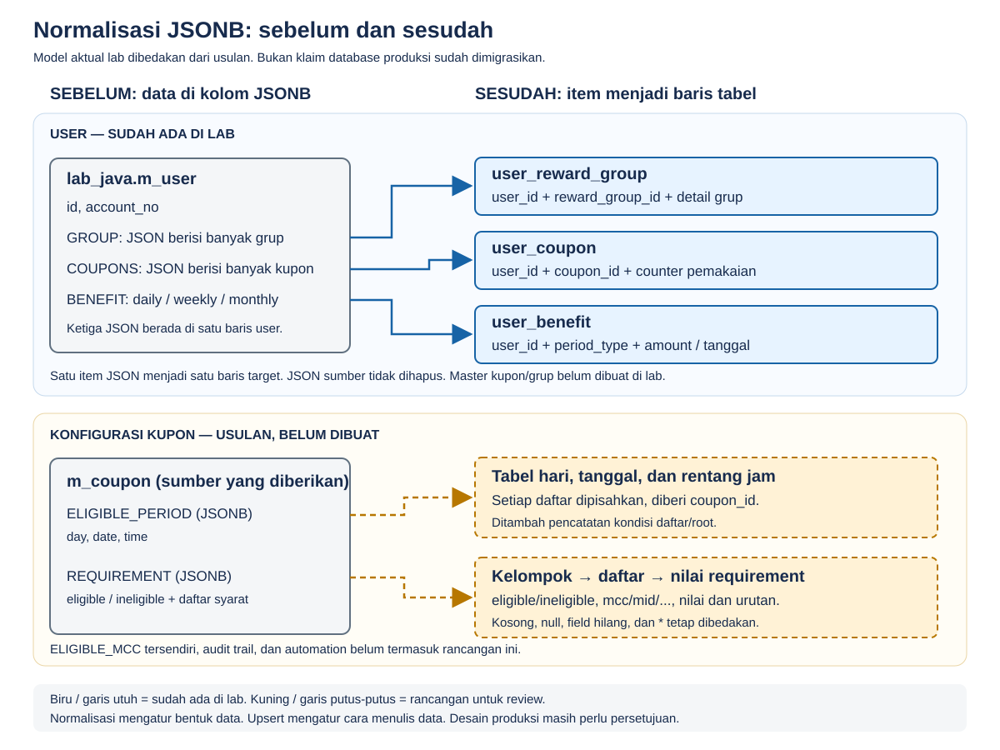
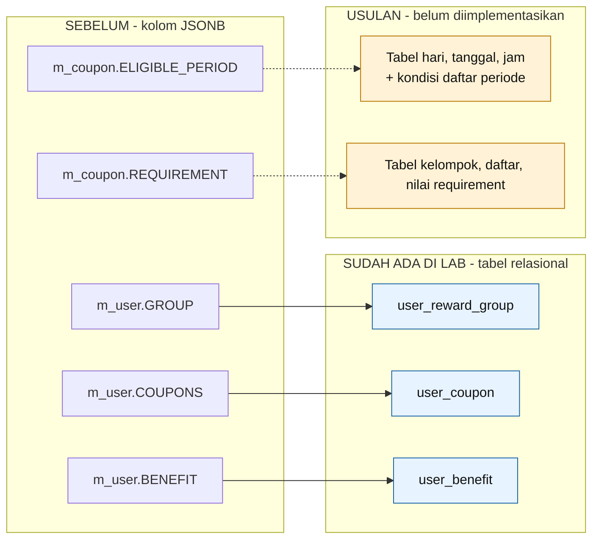
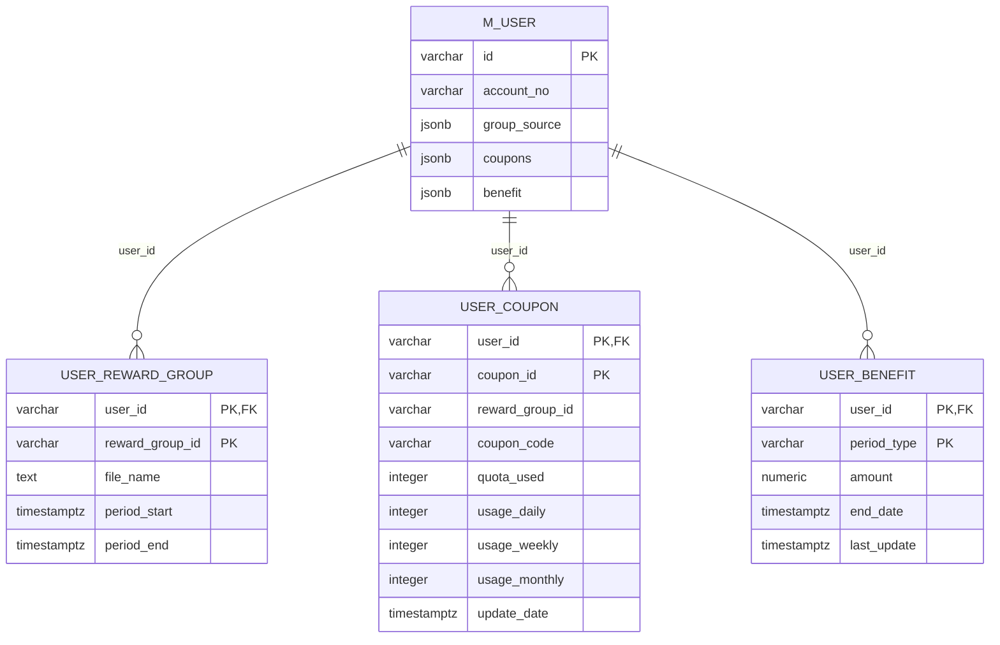
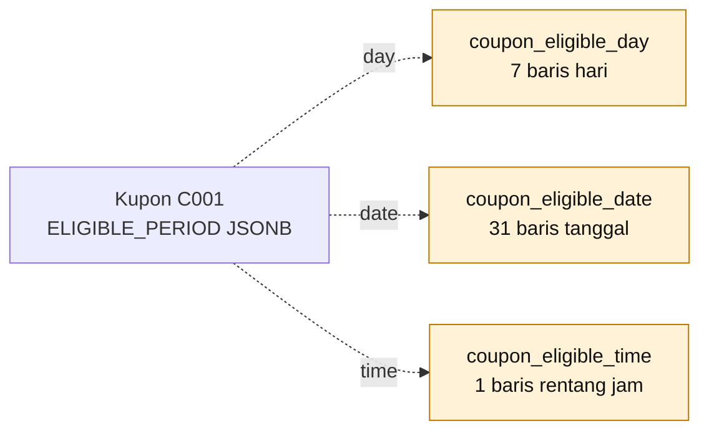
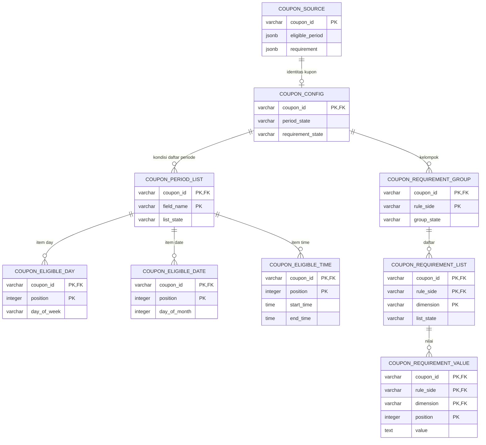

## Gambar untuk presentasi



Gambar SVG di atas bisa dibuka langsung di browser, diperbesar tanpa pecah, atau
 dipakai untuk screenshot presentasi. Diagram Mermaid di bagian berikut memberikan
 detail relasi; gambar ringkasan ini tetap bisa ditampilkan tanpa plugin Mermaid.

## 1. Ringkasan paling penting

| Bagian JSONB | Sebelum | Sesudah | Status |
| --- | --- | --- | --- |
| `m_user.GROUP` | Banyak grup dalam satu kolom JSONB | `user_reward_group` | **SUDAH ADA DI LAB** |
| `m_user.COUPONS` | Banyak kupon dalam satu kolom JSONB | `user_coupon` | **SUDAH ADA DI LAB** |
| `m_user.BENEFIT` | Daily/weekly/monthly dalam satu kolom JSONB | `user_benefit` | **SUDAH ADA DI LAB** |
| `m_coupon.ELIGIBLE_PERIOD` | Daftar hari, tanggal, dan jam dalam JSONB | Tabel hari, tanggal, dan jam + pencatatan kondisi daftar | **USULAN, BELUM DIBUAT** |
| `m_coupon.REQUIREMENT` | Daftar syarat eligible/ineligible dalam JSONB | Tabel kelompok, daftar, dan nilai syarat | **USULAN, BELUM DIBUAT** |
| `m_coupon.ELIGIBLE_MCC` | Kolom JSONB tersendiri pada struktur yang diberikan | Belum ditentukan: contoh isinya belum tersedia | **BELUM DIRANCANG** |

**Catatan nama:** sumber produksi yang diberikan memakai schema `rewardstxn`.
Implementasi benchmark menggunakan schema **`lab_java`** di database lokal khusus lab.
Ini bukan bukti bahwa tabel produksi sudah dimigrasikan.

### Diagram ringkas



- **Garis utuh:** pemecahan yang sudah ada dalam kode lab.
- **Garis putus-putus:** pemecahan yang masih direncanakan.
- Mermaid dapat ditampilkan di Markdown viewer yang mendukung Mermaid.
  Jika diagram tidak tampil, gunakan gambar teks berikut:

```text
SEBELUM                         SESUDAH                         STATUS
m_user.GROUP          ────────> user_reward_group               SUDAH DI LAB
m_user.COUPONS        ────────> user_coupon                     SUDAH DI LAB
m_user.BENEFIT        ────────> user_benefit                    SUDAH DI LAB
m_coupon.ELIGIBLE_PERIOD - - -> tabel hari / tanggal / jam       USULAN
m_coupon.REQUIREMENT     - - -> kelompok / daftar / nilai       USULAN
```

---

## 2. Sebelum normalisasi: tiga JSON user masih di satu tabel

**Tidak ada tiga tabel sumber bernama USER.GROUP, USER.COUPON, dan USER.BENEFIT.**
Nama tersebut adalah label contoh JSON. Sumbernya satu tabel `m_user` yang memiliki
kolom `GROUP`, `COUPONS`, dan `BENEFIT`.

### Bentuk tabel sumber yang diberikan, disederhanakan

| Kolom `rewardstxn.m_user` | Tipe yang diberikan | Isi |
| --- | --- | --- |
| ID | varchar(255) | Identitas user |
| ACCOUNT_NO | varchar(255) | Nomor akun |
| GROUP | jsonb | Kumpulan grup milik user |
| COUPONS | jsonb | Kumpulan kupon dan counter pemakaian user |
| BENEFIT | jsonb | Benefit daily, weekly, monthly user |
| Kolom lain | Beragam | Tidak ditampilkan agar diagram mudah dibaca |

Daftar kolom sumber belum merupakan DDL constraint lengkap; primary key/foreign key
produksi harus diverifikasi dari DDL asli.

### Contoh satu baris sebelum dipisahkan

| ID | ACCOUNT_NO | GROUP (JSONB) | COUPONS (JSONB) | BENEFIT (JSONB) |
| --- | --- | --- | --- | --- |
| U001 | ACCOUNT_DUMMY | Objek berisi G001 dan G002 | Objek berisi C001 dan C002 | Objek berisi daily, weekly, monthly |

```text
SATU BARIS m_user: U001
│
├── GROUP
│   ├── G001 → fileName, periodStart, periodEnd
│   └── G002 → fileName, periodStart, periodEnd
│
├── COUPONS
│   ├── C001 → couponId, couponCode, rewardGroupId, counter, updateDate
│   └── C002 → couponId, couponCode, rewardGroupId, counter
│
└── BENEFIT
    ├── daily   → amount, endDate, lastUpdate
    ├── weekly  → amount, endDate, lastUpdate
    └── monthly → amount, endDate, lastUpdate
```

Contoh di dokumen memakai **2 grup dan 2 kupon** agar mudah dibaca. Dummy benchmark
sebenarnya memakai **6 grup + 10 kupon + 3 benefit per user**.

---

## 3. Sesudah pemecahan user: tabel yang SUDAH ADA DI LAB

### 3.1 GROUP menjadi `user_reward_group`

Contoh potongan JSON sumber:

```json
{
  "G001": {
    "fileName": "assign-dummy",
    "periodStart": "2026-03-01T00:00:00+07:00",
    "periodEnd": "2026-03-31T23:59:59+07:00"
  },
  "G002": {
    "fileName": null,
    "periodStart": "2026-03-01T00:00:00+07:00",
    "periodEnd": "9999-01-01T00:00:00+07:00"
  }
}
```

Hasil untuk user U001:

| user_id | reward_group_id | file_name | period_start | period_end |
| --- | --- | --- | --- | --- |
| U001 | G001 | assign-dummy | 2026-03-01 00:00:00+07 | 2026-03-31 23:59:59+07 |
| U001 | G002 | NULL | 2026-03-01 00:00:00+07 | 9999-01-01 00:00:00+07 |

**Key gabungan:** `(user_id, reward_group_id)`.
`user_id` berasal dari baris user; `reward_group_id` berasal dari key JSON.
Setiap item grup menjadi satu baris.

### 3.2 COUPONS menjadi `user_coupon`

Contoh potongan JSON sumber:

```json
{
  "C001": {
    "couponId": "C001",
    "couponCode": "PROMO_A",
    "rewardGroupId": "G001",
    "quotaUsed": 2,
    "usageDaily": 1,
    "usageWeekly": 2,
    "usageMonthly": 2,
    "updateDate": "2026-03-02T10:00:00+07:00"
  },
  "C002": {
    "couponId": "C002",
    "couponCode": "PROMO_B",
    "rewardGroupId": "G002",
    "quotaUsed": 0,
    "usageDaily": 0,
    "usageWeekly": 0,
    "usageMonthly": 0
  }
}
```

Hasil untuk user U001, dibagi dua tabel tampilan agar tidak terlalu lebar:

| user_id | coupon_id | reward_group_id | coupon_code |
| --- | --- | --- | --- |
| U001 | C001 | G001 | PROMO_A |
| U001 | C002 | G002 | PROMO_B |

| user_id | coupon_id | quota_used | usage_daily | usage_weekly | usage_monthly | update_date |
| --- | --- | ---: | ---: | ---: | ---: | --- |
| U001 | C001 | 2 | 1 | 2 | 2 | 2026-03-02 10:00:00+07 |
| U001 | C002 | 0 | 0 | 0 | 0 | NULL |

**Keduanya menampilkan tabel database yang sama, bukan dua tabel baru.**
Key gabungan: `(user_id, coupon_id)`. Key JSON dan field couponId harus cocok.
Counter merupakan keadaan pemakaian saat ini, bukan history transaksi.
Pada kode lab user saat ini, updateDate yang tidak ada dipetakan menjadi SQL NULL.

### 3.3 BENEFIT menjadi `user_benefit`

Hasil pemecahan object daily/weekly/monthly, contoh disederhanakan:

| user_id | period_type | amount | end_date | last_update |
| --- | --- | ---: | --- | --- |
| U001 | daily | 0.00 | 2026-03-31 23:59:59+07 | 2026-03-02 10:00:00+07 |
| U001 | weekly | 1.00 | 2026-03-31 23:59:59+07 | 2026-03-02 10:00:00+07 |
| U001 | monthly | 2.00 | 2026-03-31 23:59:59+07 | 2026-03-02 10:00:00+07 |

Key gabungan: `(user_id, period_type)`.
`period_type` berasal dari key JSON: daily, weekly, atau monthly.

### 3.4 ERD aktual lab



`group_source` hanya label diagram agar mudah dibaca. Nama kolom sumber aktual lab adalah
`"group"`. Tipe/constraint lengkap terdapat pada `src/main/resources/schema.sql`.

**Yang benar-benar sudah ada:** ketiga target memiliki foreign key ke `lab_java.m_user(id)`.
**Yang belum ada:** master kupon/grup dan foreign key ke master tersebut. Karena itu diagram
aktual tidak menggambar hubungan USER_COUPON ke master coupon atau master reward group.

JSON sumber masih dipertahankan. Lab **menyalin dan memecah**, bukan menghapus kolom lama.
Desain ini sudah memisahkan koleksi user, tetapi bukan klaim bahwa seluruh model produksi
sudah memenuhi 3NF. Contoh hal yang masih perlu direview: coupon_code mengikuti master
coupon atau merupakan snapshot yang memang harus tersimpan pada user.

### Jumlah baris pada dummy benchmark

| User | Baris grup | Baris kupon | Baris benefit | Total tiga target |
| ---: | ---: | ---: | ---: | ---: |
| 1.000 | 6.000 | 10.000 | 3.000 | 19.000 |
| 5.000 | 30.000 | 50.000 | 15.000 | 95.000 |
| 10.000 | 60.000 | 100.000 | 30.000 | 190.000 |

Jumlah tersebut berasal dari dummy, bukan profil seluruh user produksi.

---

## 4. Sebelum normalisasi konfigurasi kupon

Ini berbeda dari **kupon milik user**:

- `m_coupon`: konfigurasi/master kupon, termasuk kapan dan dengan syarat apa kupon berlaku.
- `user_coupon`: kepemilikan serta counter pemakaian kupon oleh seorang user.

Potongan struktur sumber yang diberikan:

| Kolom `rewardstxn.m_coupon` | Tipe | Peran |
| --- | --- | --- |
| ID | varchar(255) | Identitas kupon |
| COUPON_CODE | varchar(255) | Kode kupon |
| ELIGIBLE_PERIOD | jsonb | Daftar hari, tanggal dalam bulan, rentang jam |
| REQUIREMENT | jsonb | Daftar syarat eligible/ineligible |
| ELIGIBLE_MCC | jsonb | Kolom tersendiri, struktur isinya belum tersedia |
| Kolom lain | Beragam | Tetap memerlukan review model produksi |

Contoh satu baris secara visual:

```text
MASTER KUPON C001
│
├── ELIGIBLE_PERIOD
│   ├── day  → SUNDAY, MONDAY, ..., SATURDAY
│   ├── date → "1", "2", ..., "31"
│   └── time → { start: "00:00:00", end: "23:59:59" }
│
└── REQUIREMENT
    ├── eligible
    │   ├── mcc → []
    │   ├── mid → MERCHANT_A, MERCHANT_B, ...
    │   ├── accountType → "*"
    │   └── paymentType → DCDB, DCID, OCDB, OCID
    └── ineligible
        ├── mcc → []
        ├── mid → []
        └── daftar lain → []
```

---

## 5. USULAN normalisasi ELIGIBLE_PERIOD — belum dibuat

### 5.1 Tiga daftar disimpan terpisah



**Contoh tabel hari:**

| coupon_id | position | day_of_week |
| --- | ---: | --- |
| C001 | 1 | SUNDAY |
| C001 | 2 | MONDAY |
| C001 | 3 | TUESDAY |
| C001 | 4 | WEDNESDAY |
| C001 | 5 | THURSDAY |
| C001 | 6 | FRIDAY |
| C001 | 7 | SATURDAY |

**Contoh tabel tanggal, hanya beberapa baris ditampilkan:**

| coupon_id | position | day_of_month |
| --- | ---: | ---: |
| C001 | 1 | 1 |
| C001 | 2 | 2 |
| C001 | ... | ... |
| C001 | 31 | 31 |

**Contoh tabel jam:**

| coupon_id | position | start_time | end_time |
| --- | ---: | --- | --- |
| C001 | 1 | 00:00:00 | 23:59:59 |

`position` menyimpan urutan item dalam array; duplikat tidak otomatis dibuang.
Pada DDL final, tipe tanggal/jam dan mapping teks aslinya perlu ditentukan supaya
rekonstruksi sumber tetap dapat diverifikasi tanpa pembulatan atau perubahan diam-diam.

**Mengapa terpisah?** JSON mempunyai tiga daftar, bukan daftar pasangan hari-tanggal-jam.
Dengan contoh lengkap, ada `7 + 31 + 1 = 39` item, tidak perlu membuat 217 kombinasi.

### 5.2 Pencatatan kondisi daftar

Selain tabel item, usulan memiliki `coupon_period_list`, misalnya:

| coupon_id | field_name | list_state |
| --- | --- | --- |
| C001 | day | ARRAY |
| C001 | date | ARRAY |
| C001 | time | ARRAY |

Header ini mencatat keberadaan dan bentuk daftar. Array kosong tetap mempunyai header
ARRAY tetapi tidak mempunyai item. Field yang hilang tidak mempunyai header.
JSON null dicatat berbeda. Kondisi root ELIGIBLE_PERIOD dicatat pada parent konfigurasi.

Tabel metadata ini tidak memutuskan apakah daftar kosong berarti boleh/tidak boleh;
ia hanya mempertahankan bentuk data sumber.

---

## 6. USULAN normalisasi REQUIREMENT — belum dibuat

### 6.1 Bentuk intuitif: satu item syarat menjadi satu baris

Contoh berikut dummy, bukan menyalin ID merchant asli:

| coupon_id | kelompok | jenis daftar | urutan | nilai |
| --- | --- | --- | ---: | --- |
| C001 | eligible | mid | 1 | MERCHANT_A |
| C001 | eligible | mid | 2 | MERCHANT_B |
| C001 | eligible | accountType | 1 | * |
| C001 | eligible | paymentType | 1 | DCDB |
| C001 | eligible | paymentType | 2 | DCID |
| C001 | eligible | paymentType | 3 | OCDB |
| C001 | eligible | paymentType | 4 | OCID |
| C001 | eligible | channelTransaction | 1 | * |

Di contoh sumber, mcc kosong sehingga **tidak ada baris nilai MCC**, tetapi keadaan
list kosong tetap harus dicatat. Semua kode/ID seperti MCC dan MID disimpan sebagai
teks agar angka nol di depan tidak hilang.

### 6.2 Tiga tingkat tabel agar struktur tidak hilang

```text
coupon_requirement_group
  └── coupon_requirement_list
        └── coupon_requirement_value

Kelompok eligible/ineligible
  └── jenis daftar: mcc, mid, paymentType, ...
        └── item: MERCHANT_A, DCDB, "*", ...
```

**Tabel kelompok:**

| coupon_id | rule_side | group_state |
| --- | --- | --- |
| C001 | eligible | OBJECT |
| C001 | ineligible | OBJECT |

**Tabel daftar, hanya beberapa baris ditampilkan:**

| coupon_id | rule_side | dimension | list_state |
| --- | --- | --- | --- |
| C001 | eligible | mcc | ARRAY |
| C001 | eligible | mid | ARRAY |
| C001 | eligible | accountType | ARRAY |
| C001 | eligible | paymentType | ARRAY |
| C001 | ineligible | mcc | ARRAY |
| C001 | ineligible | mid | ARRAY |

**Tabel nilai:** menyimpan coupon_id, rule_side, dimension, position, dan value
seperti contoh pada bagian 6.1. Relasinya mengarah ke header daftar yang sesuai.

Dengan struktur ini:

| Bentuk sumber | Representasi rancangan |
| --- | --- |
| `"mcc": []` | Header mcc dengan ARRAY, tanpa baris nilai |
| Field mcc tidak ada | Tidak ada header mcc |
| `"mcc": null` | Header mcc dengan JSON_NULL, tanpa baris nilai |
| `"accountType": ["*"]` | Header ARRAY dan satu baris nilai berupa teks `*` |
| Nilai sama muncul dua kali | Dua baris dengan position berbeda |

SQL NULL pada kolom sumber dan JSON null pada root juga harus dicatat terpisah
pada parent konfigurasi. Rancangan tidak menafsirkan AND/OR atau prioritas pengecualian.

### Jenis daftar dalam contoh REQUIREMENT

Semua berikut tetap dibedakan, tidak digabung menjadi satu daftar nilai tanpa label:

`mcc`, `mid`, `nmid`, `biller`, `accountType`, `paymentType`, `productCode`,
`feePaymentType`, `channelOpenAccount`, `channelTransaction`.

`REQUIREMENT.eligible.mcc` **bukan otomatis sama** dengan kolom JSONB terpisah
`m_coupon.ELIGIBLE_MCC`.

---

## 7. Diagram gabungan USULAN konfigurasi kupon

> Seluruh tabel pada diagram bagian ini **belum ada dalam kode lab**.
> Nama tabel/kolom dan constraint final masih perlu review.



Diagram menggambarkan kepemilikan item oleh daftar masing-masing. Detail foreign key
untuk tabel day/date/time harus dibatasi pada header field_name yang sesuai dalam DDL
final. Diagram ini bukan DDL yang siap dijalankan.

`COUPON_SOURCE` adalah sumber lab minimal yang direncanakan, **bukan pengganti seluruh
m_coupon produksi**. Master produksi mempunyai banyak kolom lain yang tidak digambar.
`COUPON_CONFIG` mencatat status root JSON tanpa menyimpan isi daftar sebagai JSONB lagi.

Untuk diagram akhir produksi, hubungan user_coupon ke master coupon, user_reward_group
ke master reward group, serta apakah coupon_code perlu snapshot masih harus direview.

---

## 8. Audit trail dan JSONB lain: jangan disamakan dengan master

Daftar struktur yang diberikan juga menyebut JSONB pada tabel lain, seperti automation,
audit trail, dan history housekeeping. Itu **bukan bagian yang sudah diimplementasikan**.

Jika audit trail dinormalisasi, tabel anak harus terhubung ke **ID baris audit**, bukan
hanya coupon_id. Satu kupon dapat memiliki beberapa snapshot dengan isi berbeda.
Menghubungkan semua history hanya ke master terbaru dapat menghilangkan keadaan historis.

Beberapa bagian daftar struktur sumber berulang/tidak memiliki judul tabel yang jelas.
DDL asli dan contoh isi kolom tambahan perlu diverifikasi sebelum desainnya dibuat.

---

## 9. Normalisasi tidak sama dengan upsert

```text
NORMALISASI → menentukan bentuk tabel dan hubungan data
UPSERT      → menentukan tindakan saat menulis: insert / update / lewati
```

Pada tiga target user yang sudah ada, writer lab menggunakan selective upsert:
key baru di-insert, hanya non-key berbeda di-update, nilai sama dilewati, dan item hilang
 tidak dihapus. Ini khusus lab satu writer, bukan jaminan concurrency produksi.

Desain tabel konfigurasi kupon di dokumen ini belum mempunyai implementasi migrasi atau
sinkronisasi. Penanganan perubahan dan penghapusan anggota daftar harus ditentukan saat
menyiapkan tool migrasinya; jangan otomatis menganggap aturan no-delete user cocok untuk
konfigurasi kupon terbaru.

### Referensi dalam project

- `src/main/resources/schema.sql`: DDL empat tabel user lab yang sudah ada.
- `src/main/resources/seed.sql`: dummy 6 grup, 10 kupon, 3 benefit per user.
- `src/main/java/lab/Transformer.java`: mapping tiga JSON user ke baris target.
- `src/main/java/lab/Writers.java`: penulisan selective upsert.
- `README.md`: cara menjalankan dan membaca hasil benchmark.

**Status dokumen: model aktual lab + rancangan tambahan untuk diskusi, bukan persetujuan
model database produksi dan bukan implementasi normalisasi kupon.**
